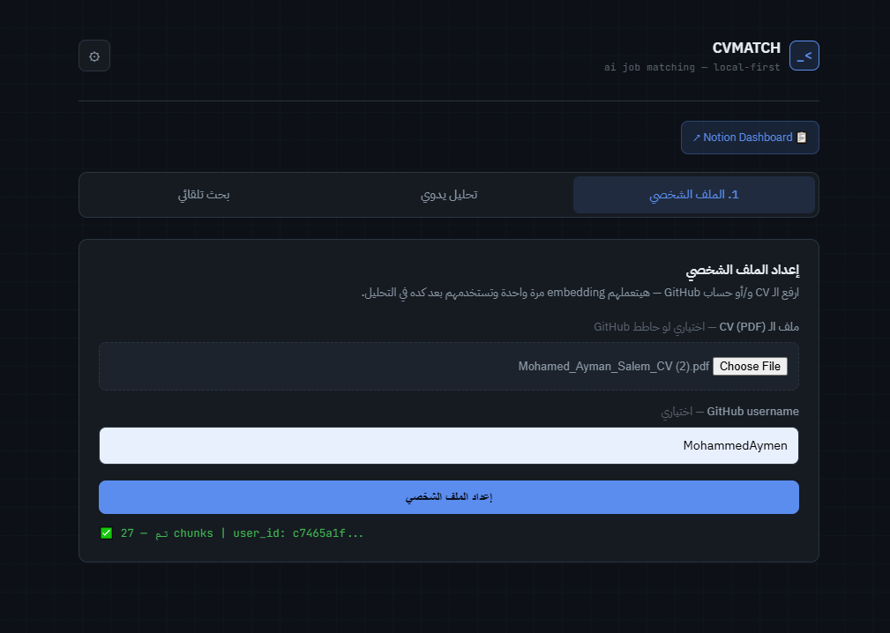
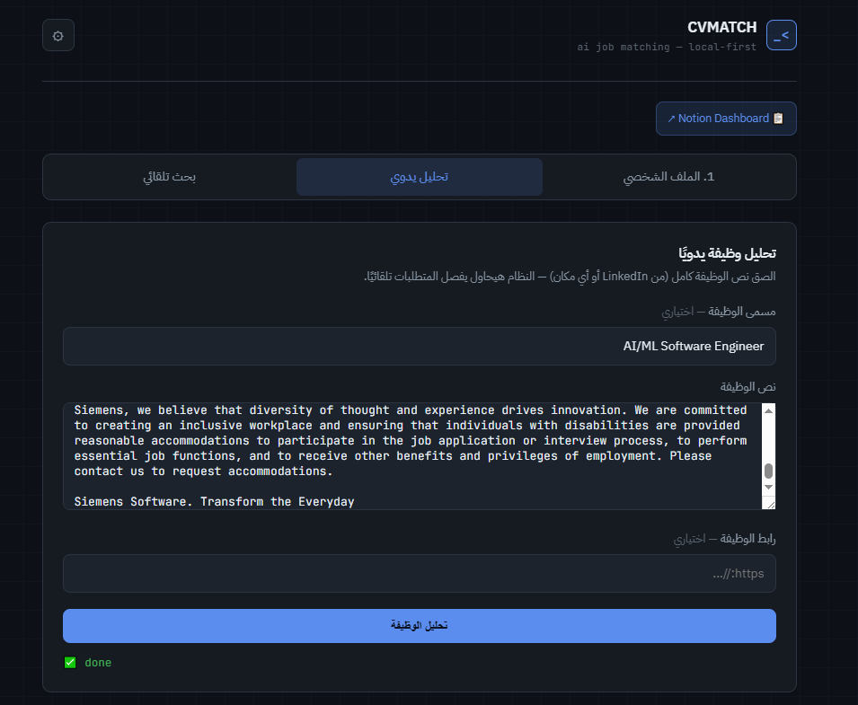
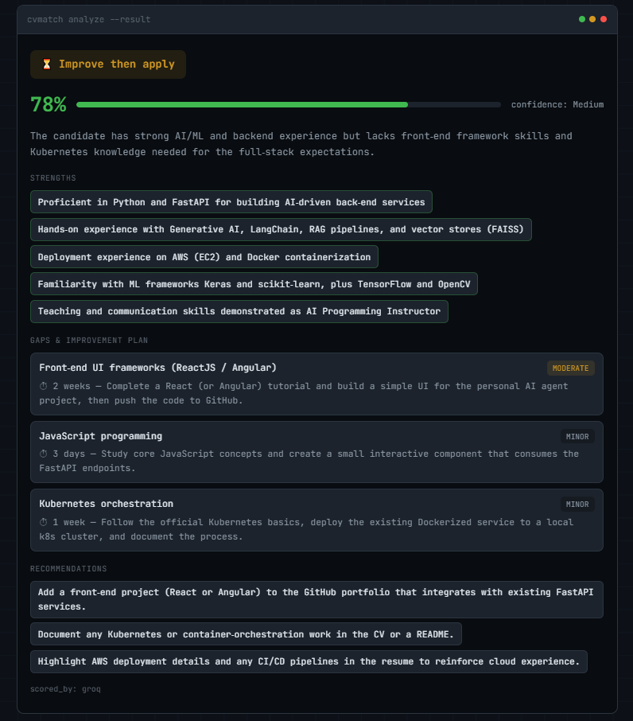
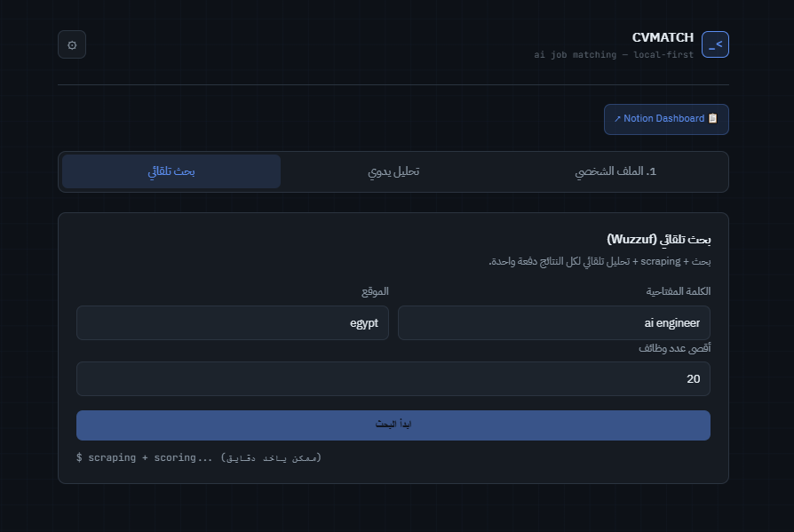
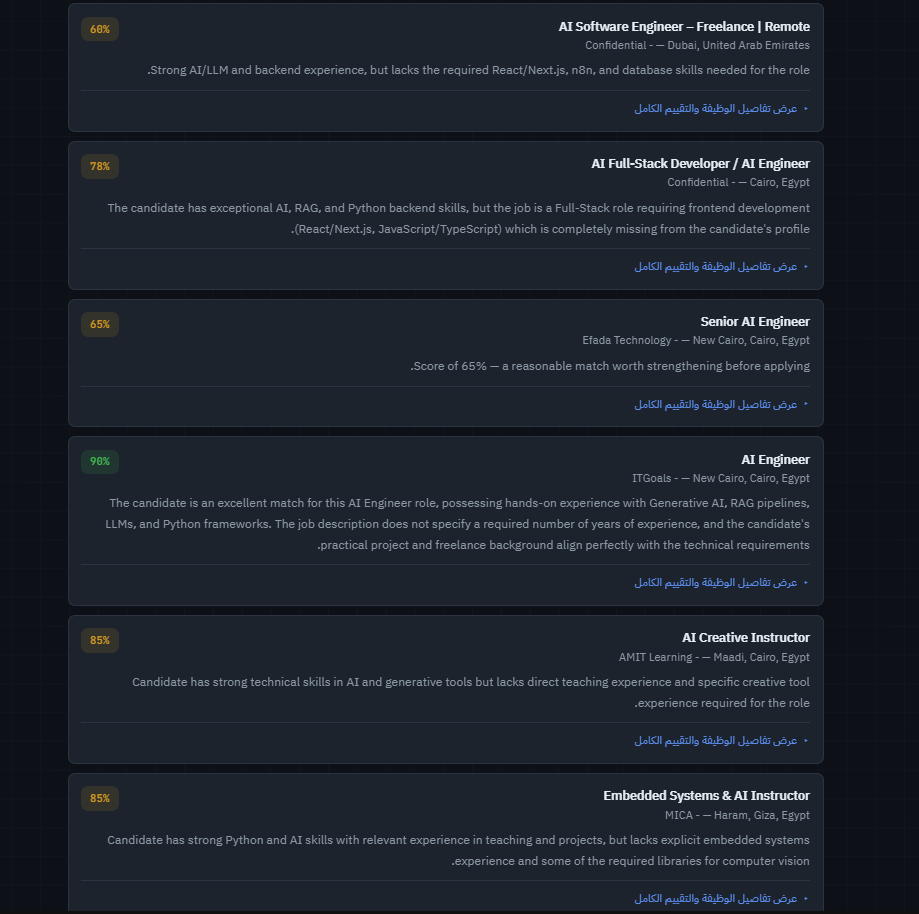
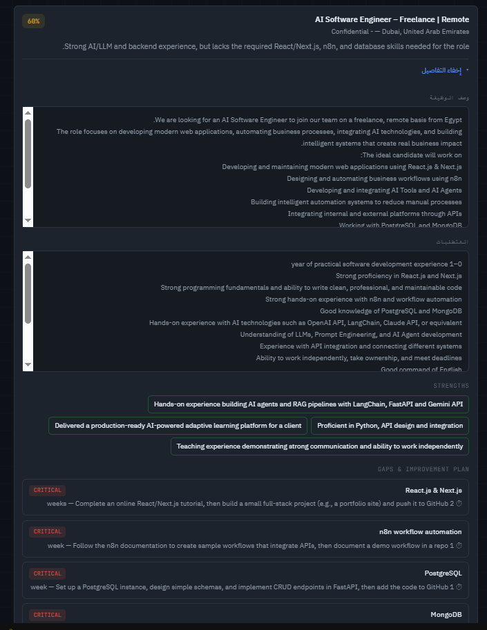
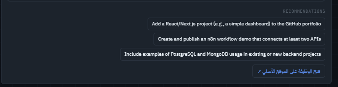
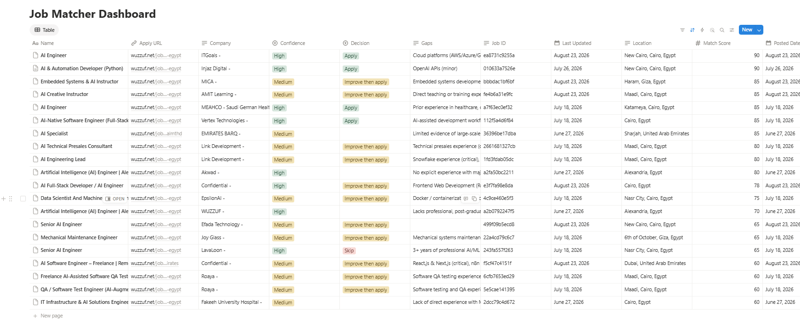
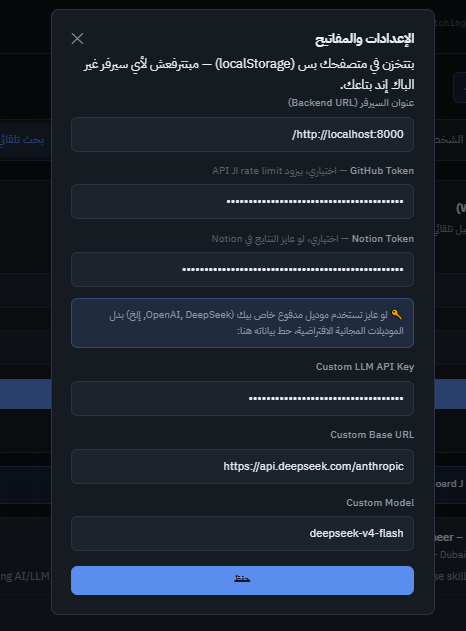

# CVMATCH


**CVMATCH** is an AI-powered job matching engine. It reads your CV and (optionally) your GitHub profile, embeds them into a vector store, scrapes live job postings, scores each one against your real profile using an LLM, and pushes the qualified matches straight into a Notion dashboard.

Instead of scrolling through job boards manually, you get a ranked shortlist with a match score, a plain-language explanation of *why* it fits, and the actual skill gaps to work on.

---

## Demo

**1. Set up your profile once** — upload your CV (and optionally your GitHub username), and it gets embedded for matching.



**2. Two ways to analyze a job** — paste one manually, or let it search live listings automatically.



**3. Get a real match score with reasoning** — not just a percentage, but strengths, gaps, and a concrete improvement plan.



**4. Or run an automatic search** — one query scrapes, scores, and ranks every result in one pass.





**5. Expand any result** for the full job description, requirements, and a gap-by-gap breakdown with time estimates.




**6. Everything syncs to a Notion dashboard** for tracking applications over time.



**7. Bring your own API key** (OpenAI, DeepSeek, etc.) from Settings — stored only in your browser's localStorage, never sent to any server but the one you point it at.



---

## Table of contents

- [Demo](#demo)
- [Quick start](#quick-start)
- [How it works](#how-it-works)
- [Tech stack](#tech-stack)
- [Project layout](#project-layout)
- [API endpoints](#api-endpoints)
- [Usage examples](#usage-examples)
- [How scoring works](#how-scoring-works)
- [BYOK & settings](#byok--settings-bring-your-own-key)
- [Setup](#setup)
- [Debugging notes from getting this running](#debugging-notes-from-getting-this-running)
- [Known limitations / roadmap](#known-limitations--roadmap)
- [Contributing](#contributing)

---

## Quick start

```bash
git clone <this-repo>
cd CVMATCH
pip install -r requirements.txt
playwright install chromium
cp .env.example .env        # add at least GROQ_API_KEY or GEMINI_API_KEY
python main.py               # → http://localhost:8000
```

The frontend is hosted separately at **[cvfrrontend.vercel.app](https://cvfrrontend.vercel.app/)** — no local setup needed for it. It defaults to talking to a backend running at `http://localhost:8000`, so as long as you have `python main.py` running locally (per above), just open the deployed link and you're ready to run a profile setup + job search. If your backend lives somewhere else, update the API base URL in Settings.

---

## How it works

```
┌──────────────┐     ┌───────────────┐     ┌─────────────────┐     ┌──────────────┐     ┌─────────────┐
│  CV (PDF) +  │ ──▶ │   Embedding    │ ──▶ │  Job Scraping    │ ──▶ │  LLM Scoring │ ──▶ │   Notion    │
│ GitHub repos │     │  (ChromaDB +   │     │  (Wuzzuf via     │     │  (Groq →     │     │  Dashboard  │
│              │     │ sentence-      │     │  Playwright)     │     │  Gemini →    │     │             │
│              │     │ transformers)  │     │                  │     │  local Qwen) │     │             │
└──────────────┘     └───────────────┘     └──────────────────┘     └──────────────┘     └─────────────┘
```

1. **Profile setup** (`/profile/setup`) — Upload a CV (PDF) and/or a GitHub username. The CV is parsed with PyMuPDF, GitHub repos are pulled via the GitHub API, everything is chunked and embedded into a per-session ChromaDB collection.
2. **Job search** (`/jobs/search`) — Wuzzuf is scraped for live postings matching your query/location. Each job is compared against your embedded profile.
3. **Scoring** — Every candidate job is scored by an LLM against your actual CV/GitHub content (not just keyword matching), returning a score, strengths, gaps, and a recommendation.
4. **Filtering** — Only jobs above the score threshold are kept (handled inline inside `matching/pipeline.py`'s final stage).
5. **Notion export** — Qualified matches are pushed to a Notion database as a live dashboard, with resumable checkpoints (`scripts/upload_checkpoint.py`) in case the upload gets interrupted midway.

The frontend at **[cvfrrontend.vercel.app](https://cvfrrontend.vercel.app/)** drives the whole flow — profile setup, job search, manual single-job analysis, and settings (API base URL, BYOK keys, Notion token).

---

## Tech stack

| Layer | Tools |
|---|---|
| API | FastAPI, Uvicorn |
| Embeddings / Vector store | `sentence-transformers` (`nomic-embed-text-v1.5`), ChromaDB |
| CV parsing | PyMuPDF (`fitz`) |
| Scraping | Playwright (async), `tenacity` for retries |
| LLM scoring | Custom `AIClient` with automatic fallback chain: **Groq → Gemini → local Qwen3 (Ollama)**, plus BYOK support (caller can pass their own key per-request, never persisted) |
| Export | `notion-client` |
| Logging | `loguru` |

---

## Project layout

```
main.py                  FastAPI app — all HTTP endpoints
core/
  config.py               Settings (env-driven)
  ai_client.py             Multi-provider LLM client with fallback + BYOK
  logger.py, cache.py, models.py
profile_data/
  cv_parser.py             PDF → text chunks
  github_fetcher.py        GitHub repos → text chunks
  embedder.py               Builds/queries the ChromaDB collection
collectors/
  wuzzuff.py                Live job scraper (Wuzzuf) — the only active source
  base.py                    Shared scraper behaviour (retries, human-like delays)
matching/
  pipeline.py, scorer.py    Similarity search + LLM scoring + score-threshold filtering
notion/
  dashboard.py               Push results to a Notion database
  upload_checkpoint.py       Resumable upload state
frontend/
  Frontend index.html        Single-page UI (Setup / Search / Manual analysis / Settings)
scripts/                    Manual test scripts per module
```

---

## API endpoints

| Method | Path | Purpose |
|---|---|---|
| `GET` | `/health` | Health check |
| `POST` | `/profile/setup` | Upload CV + optional GitHub username → creates a session, returns `user_id` |
| `POST` | `/jobs/search?user_id=...` | Scrape + score jobs against that session's profile |
| `POST` | `/jobs/analyze-manual?user_id=...` | Score a single pasted job description against the profile |
| `GET` | `/ai/stats` | Current LLM provider chain / usage stats |
| `POST` | `/ai/reset/{provider}` | Reset a specific provider's failure state |
| `DELETE` | `/profile/{user_id}` | Delete a session and its embeddings |

Sessions live in memory (`app.state.sessions`), keyed by `user_id`, for the lifetime of the running process.

---

## Usage examples

### 1. Set up a profile (CV + GitHub)

```bash
curl -X POST "http://localhost:8000/profile/setup?github_username=octocat" \
  -F "cv_file=@/path/to/cv.pdf"
```

Response:
```json
{
  "status": "success",
  "user_id": "1afb4beb-2c3d-4a11-9e77-9a2b6a0e5f10",
  "message": "Profile processed successfully.",
  "total_chunks": 42,
  "embedding_model": "nomic-ai/nomic-embed-text-v1.5"
}
```

Save `user_id` — every other call needs it.

### 2. Search + score live jobs

```bash
curl -X POST "http://localhost:8000/jobs/search?user_id=1afb4beb-2c3d-4a11-9e77-9a2b6a0e5f10" \
  -H "Content-Type: application/json" \
  -d '{"query": "python developer", "location": "egypt", "max_jobs": 20}'
```

Response (truncated):
```json
{
  "total_jobs": 18,
  "qualified_jobs": 3,
  "jobs": [
    {
      "title": "Backend Developer (Python)",
      "company": "Acme Egypt",
      "location": "Cairo, Egypt",
      "match_score": 82,
      "confidence": "High",
      "decision": "Apply",
      "explanation": "Strong FastAPI/Python match with directly relevant GitHub projects.",
      "strengths": ["3+ FastAPI projects on GitHub", "Async programming experience"],
      "gaps": [
        {"skill": "Docker", "severity": "moderate", "effort_estimate": "1 week",
         "learning_direction": "Dockerize one existing project end-to-end"}
      ],
      "recommendations": ["Add a Dockerized project to GitHub"],
      "apply_link": "https://wuzzuf.net/jobs/...",
      "scored_by": "groq",
      "from_cache": false
    }
  ],
  "notion_link": null,
  "provider_stats": {"groq": 15, "gemini": 2, "qwen": 1}
}
```

### 3. Analyze a single pasted job description (no scraping)

```bash
curl -X POST "http://localhost:8000/jobs/analyze-manual?user_id=1afb4beb-2c3d-4a11-9e77-9a2b6a0e5f10" \
  -H "Content-Type: application/json" \
  -d '{
        "job_title": "Senior Backend Engineer",
        "job_text": "We need someone with 4+ years Python, FastAPI, PostgreSQL, and AWS...",
        "job_link": "https://linkedin.com/jobs/view/..."
      }'
```

### 4. Check LLM provider health

```bash
curl http://localhost:8000/ai/stats
```

### 5. Delete a session (removes its embeddings too)

```bash
curl -X DELETE http://localhost:8000/profile/1afb4beb-2c3d-4a11-9e77-9a2b6a0e5f10
```

---

## How scoring works

Matching happens in stages, not a single similarity number:

1. **Stage 1 — embedding similarity filter.** Each scraped job is embedded and compared against your profile chunks in ChromaDB (cosine similarity). Jobs below `similarity_threshold = 0.50` are dropped before ever reaching the LLM — this keeps LLM calls (and cost) down.
2. **Stage 2 — LLM scoring.** Surviving jobs go to `JobScorer` (`matching/scorer.py`), which sends your top 5 most relevant profile chunks + the job text to the LLM and asks for a structured JSON verdict:
   - **`score`** — 0-100 integer, how well you match overall
   - **`confidence`** — `Low` / `Medium` / `High`, how sure the model is given the evidence available
   - **`decision`** — `Apply`, `Improve then apply`, or `Skip`
   - **`gaps`** — each with a `severity` (`minor`/`moderate`/`critical`), an `effort_estimate`, and a concrete `learning_direction` (not generic advice)
   - **`strengths`**, **`recommendations`**, **`summary`**
3. **Stage 3 — final score filter.** Only jobs scoring `≥ llm_score_threshold = 60.0` make it into the response and get pushed to Notion.

Both thresholds (`0.50` and `60.0`) are currently **hardcoded** in the `/jobs/search` handler in `main.py` (not env-configurable yet) — worth promoting to `core/config.py` env vars if you want to tune them without editing code.

---

## BYOK & Settings (bring your own key)

The frontend's **Settings** panel lets a user supply their own credentials instead of relying on the server's shared keys:

- **API base URL** — where the frontend sends requests (defaults to `http://localhost:8000`)
- **GitHub token** — sent as a `Form` field on `/profile/setup` (not a query param, so it doesn't end up in server access logs/URLs); used only for that request to raise GitHub API rate limits, kept in the in-memory session for that user, never written to disk or `.env`
- **Notion token / database ID** — same pattern; if provided, results are pushed live to that Notion database, otherwise results just come back in the API response
- **Custom LLM key/base URL/model** — on `/jobs/analyze-manual` specifically, a caller can pass `custom_api_key`, `custom_base_url`, `custom_model` to route that single scoring call through their own provider instead of the server's Groq/Gemini/Ollama chain. This is per-request only — `matching/scorer.py` forwards it straight to `AIClient.complete()` and it's never persisted.

Note: `/jobs/search` does **not** currently accept BYOK LLM parameters — it always uses the shared `app.state.ai_client` (server's own Groq/Gemini keys, falling back to local Ollama). Only the manual single-job analysis endpoint supports per-request custom keys today.

---

## Setup

```bash
pip install -r requirements.txt
playwright install chromium
cp .env.example .env   # fill in the keys you have
python main.py
```

### Environment variables

| Variable | Required | Notes |
|---|---|---|
| `GROQ_API_KEY` | recommended | First LLM in the fallback chain |
| `GEMINI_API_KEY` | recommended | Second fallback |
| — local Ollama (`qwen3:4b`) | optional | Final fallback, runs fully offline |
| `GITHUB_TOKEN` | optional | Raises GitHub API rate limits |
| `NOTION_TOKEN`, `NOTION_DATABASE_ID` | optional | Only needed for the Notion export step |
| `EMBEDDING_MODEL` | optional | Default: `nomic-ai/nomic-embed-text-v1.5` |
| `CHROMA_PERSIST_DIRECTORY` | optional | Default: `data/chroma_db` |
| `HEADLESS` | optional | Run the scraper browser headless (default `False`) |

### Running the server — important

Run it plainly, **without `--reload`**, for normal use:

```bash
python main.py
```

If you want auto-reload during development, exclude the data/log folders explicitly so the reloader doesn't get confused by files the app itself writes at runtime:

```bash
uvicorn main:app --reload --reload-exclude "data/*" --reload-exclude "logs/*"
```

---

## Debugging notes from getting this running

A couple of real issues came up while shaking this project out — documenting them here so they don't get re-investigated from scratch later:

- **"Session not recognized" between Profile Setup and Job Search.**
  Traced this end-to-end: the frontend's `userId` handling and the backend's `app.state.sessions` lookup are both correct — verified by replaying the exact `/profile/setup` → `/jobs/search` sequence against the real session code. The actual symptom turned out to be a `500` from `/profile/setup` itself (see below), which meant no `user_id` was ever returned — the session logic was never the problem.

- **`/profile/setup` returning `500: The paging file is too small for this operation to complete (os error 1455)`.**
  Root cause: `SentenceTransformer(...)` in `profile_data/embedder.py` is instantiated fresh **on every single `/profile/setup` call**, instead of being loaded once. Repeated setup calls kept piling up memory until Windows' page file couldn't keep up.
  - Immediate fix: increase the Windows virtual memory (page file) size, or restart before retrying.
  - Proper fix (not yet applied — flagging for next pass): load the embedding model **once at app startup** (same pattern already used for `AIClient` in the `lifespan` handler) and reuse it across all sessions. Only the per-user ChromaDB *collection* needs to be per-session, not the model itself.

---

## Known limitations / roadmap

- Sessions are in-memory only — restarting the server or running multiple Uvicorn workers loses active sessions (fine for local/single-worker use, not production-ready as-is).
- The embedding model reload-per-request issue above is still open.
- `scripts/` has manual per-module smoke tests. An automated RAG-quality suite now lives in `evaluation/` + `tests/test_rag_triad.py` — see "Testing / RAG Triad evaluation" below.
- `data/`, `logs/`, and `__pycache__/` should be excluded from version control (`.gitignore`) since real CVs and scrape logs land there during use.
- Hosted-provider model names (`GROQ_MODELS` in `core/ai_client.py`) are hardcoded and will break silently (404s buried in retry logs) whenever a provider deprecates a model — worth an occasional check against the provider's own deprecation page rather than waiting for it to show up as mysterious rate-limit-looking failures.

---

## Testing / RAG Triad evaluation

The matching pipeline is a RAG system (ChromaDB retrieval + LLM scoring), so
"does it work" isn't a single test — it's three separate questions:

1. **Context relevance** — is the ChromaDB retrieval step pulling CV/GitHub
   chunks that are actually relevant to the job posting?
2. **Groundedness** — is everything the LLM says (strengths, gaps,
   explanation) actually backed by the retrieved chunks, or is it inventing
   things ("hallucinating")?
3. **Answer relevance** — does the final response actually address the job
   (a clear match decision), rather than being generic or off-topic?

This is the standard "RAG Triad" evaluation pattern. Each axis is scored
0.0-1.0 by an LLM judge (reusing the project's own `AIClient` fallback
chain), with reasoning kept alongside every score so a low score is
debuggable, not just a number.

```
evaluation/
  rag_triad.py    # the judge: context_relevance / groundedness / answer_relevance
  dataset.py      # golden test set (fixed) + real job sampler (from data/checkpoints/)
  report.py       # console table + markdown + json report generation
  run_eval.py     # CLI entrypoint
tests/
  test_rag_triad.py   # pytest suite, marked `integration`
```

Run it standalone:

```bash
python -m evaluation.run_eval                          # golden set, top_k=10
python -m evaluation.run_eval --source checkpoints --n 8   # sample real scraped jobs instead
python -m evaluation.run_eval --judge-model gemini-2.5-flash   # force a specific judge model
```

This prints a per-job table (context/groundedness/answer scores + pass/fail),
lists any hallucinated ("unsupported") claims explicitly, and writes a JSON +
Markdown report to `data/eval_reports/`. Exit code is `1` if anything fails
its threshold — plug it into CI or run it after any prompt change.

Add `--update-readme` to also refresh the "Latest results" table below in
this file:

```bash
python -m evaluation.run_eval --update-readme
```

### Latest results

<!-- RAG_TRIAD_RESULTS_START -->
_Last run: 2026-08-02 19:13 — 4/5 jobs passed._

| Job | Context Relevance | Groundedness | Answer Relevance | Avg | Result |
|---|---|---|---|---|---|
| Python Backend Developer (FastAPI) | 0.56 | 0.93 | 0.90 | 0.80 | ✅ |
| Senior Cloud/DevOps Engineer | 0.27 | 0.97 | 0.90 | 0.71 | ✅ |
| AI/LLM Engineer | 0.61 | 0.88 | 0.90 | 0.80 | ✅ |
| Enterprise Sales Account Executive | 0.00 | 0.86 | 0.90 | 0.59 | ✅ |
| Junior QA Tester | 0.31 | 0.95 | 0.00 | 0.42 | ❌ |
<!-- RAG_TRIAD_RESULTS_END -->

Or run it as pytest:

```bash
pytest tests/test_rag_triad.py -v          # needs GROQ_API_KEY or GEMINI_API_KEY, and
                                            # a non-empty data/chroma_db collection
pytest tests/ -m "not integration"         # skip these in a fast/unit-only run
```

**Caveats worth knowing:**
- These are integration tests: they call real LLM providers and cost tokens.
  They're skipped (not failed) automatically if no provider is configured or
  the ChromaDB collection is empty.
- Judging with the same model chain used for generation can under-catch a
  model's own blind spots. Pass `--judge-model` (or a differently-configured
  `AIClient`) to judge with a different model than the one that generated
  the response, when you can afford it.
- The golden set in `evaluation/dataset.py` is deliberately small and
  deliberately includes an "easy fail" case (a near-empty job posting) and a
  wrong-domain case (sales vs. a technical profile) — these exist to catch
  the pipeline being *too* confident, not just to check it works on easy
  inputs. Extend it as you find more real failure patterns.

### Repeated-run accuracy, not a single pass/fail

Because scoring runs through an LLM, a single green pytest run doesn't mean
much on its own — the same prompt can pass on one run and fail on the next.
`scripts/run_accuracy_eval.py` (standalone, not part of pytest) repeats the
golden set N times and reports a **pass-rate percentage per job**, plus the
overall aggregate and per-metric standard deviation, specifically to
distinguish "this job is stable" from "this job is flaky":

```bash
python evaluation/run_accuracy_eval.py --runs 5
python evaluation/run_accuracy_eval.py --job "AI/LLM" --runs 3 --verbose   # focus one job + full failure detail
```

> Note: `scripts/run_accuracy_eval.py` still exists but is an older, stripped-down
> duplicate (only `--runs`, no `--job`/`--verbose`) — `evaluation/run_accuracy_eval.py`
> is the one being actively developed. Consider deleting the `scripts/` copy to avoid
> the two drifting further apart.

### RAG quality: issues found and fixed via the evaluation harness

Running the golden set repeatedly (not once) surfaced several real bugs that
a single pass would have missed entirely, since this is a probabilistic
system. In rough order of how they were found:

1. **Retrieval was silently dropping evidence.** `matching/scorer.py`
   fetched 10 chunks but only forwarded the first 5 to the LLM. A
   candidate's own "Skills" chunk mentioning a specific tool consistently
   ranked outside that cutoff (short keyword lists score lower semantically
   than narrative project chunks), so the LLM — correctly, given what it was
   shown — claimed the skill was missing. Fixed with a hybrid retrieval step
   (`ProfileEmbedder.retrieve_hybrid_chunks`): dense top-5 plus up to 3
   keyword-matched chunks for any tool/skill named explicitly in the job
   posting, so token cost only grows when there's an actual gap to close.

2. **The few-shot example in the prompt was leaking into unrelated jobs.**
   The "Required JSON Output" example used a real, specific gap on a
   same-domain example job. The model was pattern-completing the example
   instead of reading the actual context, on a subset of runs. Rewrote the
   example around unrelated skills, added an explicit "this is a format
   example, not content to copy" instruction, plus a self-check rule
   ("before listing a gap, re-check it's actually absent from the context
   above").

3. **Reasoning-model output was silently corrupting parsed gaps.** After a
   Groq model deprecation forced a switch to reasoning-capable models that
   emit visible `<think>...</think>` output before the JSON, the Groq call
   path had no stripping for it (only the local Qwen path did), breaking
   JSON parsing intermittently. Worse, the fallback "partial JSON recovery"
   path treated `gaps` as a flat string array when it's actually an array of
   objects, so any recovery attempt silently produced zero gaps instead of
   the real ones. Fixed both: `<think>` stripping on the Groq path, and a
   dedicated object-aware extractor for `gaps`.

4. **The judge could fall back to the same small model it was meant to be
   checking.** When the primary providers were both rate-limited,
   `RAGTriadJudge` inherited the scorer's full fallback chain, including a
   small local model — which then both answered *and judged its own
   answer*, occasionally inventing claims that were never in the response
   it was grading. The judge now runs on an independent client instance
   restricted to the two hosted providers (sharing the same circuit-breaker
   state, separate provider order), so it never grades using the weakest
   available model.

5. **A single transient rate-limit response disabled a provider for a full
   hour.** The quota-exhausted handler fired on the *first* 429, with no
   retry. It now gets the same retry-with-backoff treatment as any other
   error, only escalating to the hour-long cooldown after retries are
   exhausted.

None of this shows up as a single "broken" test — it shows up as a stability
rate across repeated runs, which is exactly what `run_accuracy_eval.py`
above was built to catch.

---

## Contributing

This is currently a solo/local project without a formal contribution process. If that changes:

1. Open an issue describing the bug or feature before sending a PR, so direction is agreed on first
2. Keep PRs scoped to one change at a time
3. Match the existing code style (Arabic inline comments for business logic/reasoning, English for structural/technical comments — this project already mixes both, keep that consistent)
4. Run the relevant `scripts/test_*.py` smoke test for whatever module was touched before submitting
5. Anti-bot-sensitive changes (scrapers, new job sources) should include a note on rate limiting / ToS considerations — Wuzzuf is the only source scraped today, deliberately, for exactly that reason

---

## 👨‍💻 Author

**Mohamed Aymen Salem** — AI Engineer & Developer
Machine Learning · Computer Vision · NLP

[](https://github.com/MohammedAymen)
[](https://portfolio-wine-nine-73.vercel.app/)
[](https://www.linkedin.com/in/mohamed-aymen-750236225)

If this project was useful or interesting, a ⭐ on the repo helps others find it.